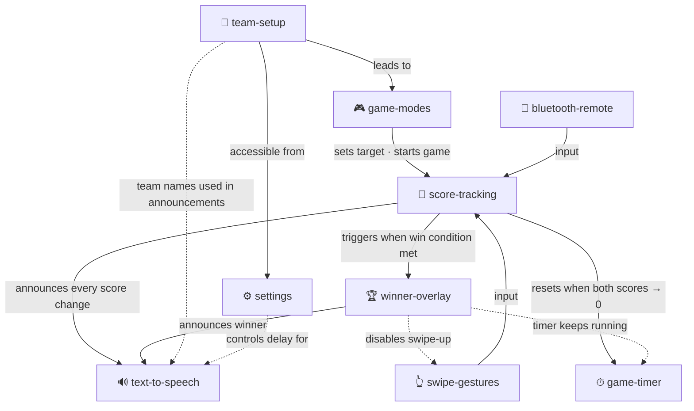

# ScoreCounter — Feature Documentation

One file per feature. Each file describes what the feature does, how it behaves, and links to related features.

## Files

| File | Description |
|------|-------------|
| [team-setup.md](team-setup.md) | Name input screen — first step before a match |
| [game-modes.md](game-modes.md) | Set length selection (15 / 21 / 25 / custom) |
| [score-tracking.md](score-tracking.md) | Points, undo history, win detection |
| [swipe-gestures.md](swipe-gestures.md) | Swipe-up to score, swipe-down to undo |
| [bluetooth-remote.md](bluetooth-remote.md) | Volume HID remote and custom BLE two-button device |
| [text-to-speech.md](text-to-speech.md) | Auto-announce and on-demand score read-out |
| [game-timer.md](game-timer.md) | Elapsed match time display |
| [winner-overlay.md](winner-overlay.md) | Win detection, trophy overlay, rematch |
| [settings.md](settings.md) | In-app settings screen (announcement delay) |

---

## Dependency Graph

Solid arrows = primary data / event flow.  
Dashed arrows = behavioural constraint (one feature affects another's behaviour).

### Reading the graph

- **Team Setup → Game Modes → Score Tracking** is the linear app flow from launch to gameplay.
- **Swipe Gestures** and **Bluetooth Remote** are two independent input paths that both feed into **Score Tracking**.
- **Score Tracking** is the central hub: every point change fans out to **Winner Overlay**, **Text-to-Speech**, and **Game Timer**.
- **Winner Overlay** has downstream effects on **Text-to-Speech** (win call) and constrains **Swipe Gestures** (blocks scoring swipe).
- **Game Timer** is passive — it is only driven by score state, never driving anything else.
